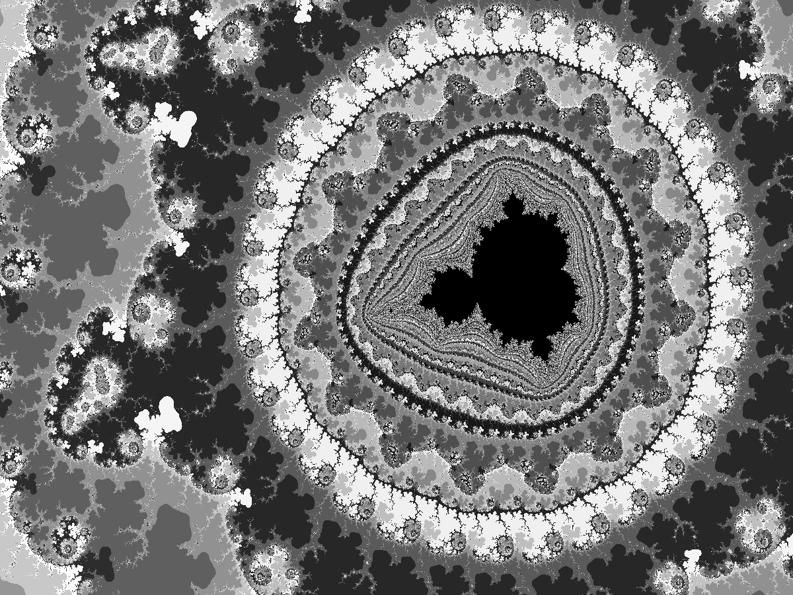

## Authors

- Ryther Anderson

## Motivation
For making interesting and aesthetic fractal images quickly and easily using Python. The code
was written to be able to generate many different and unique fractals using only a few functions.
The mandelbrot and julia functions take as input the complex valued function that is iterated over
(i.e. many functions, rather than just z^2 + c).

## Current Status
There are functions for Mandelbrot and Julia set generation, image and animation creation. There is
a function for Buddhabrot generation and a function for the "nebula" coloring of the Buddhabrot. 
There is a class for creating and visualizaing 2D random walks (with bias, if desired). The most recent 
addition is a function for generating Markus-Lyapunov fractals, with a special image function for the
"classic" blue/green coloring.

## Usage
See examples.py for usage examples of each function.

## Example Images

