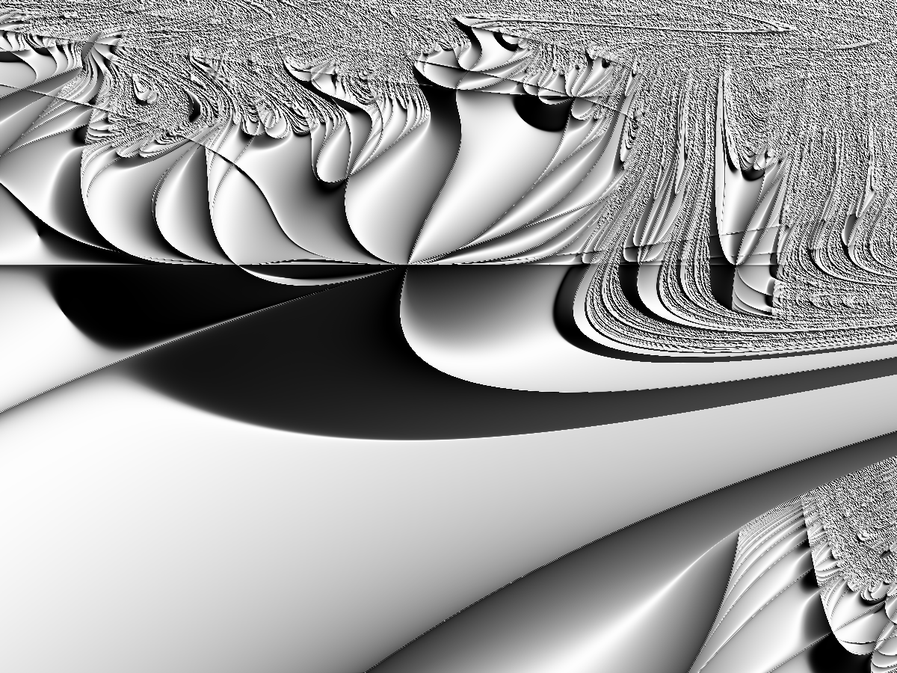

## Authors

- Ryther Anderson

## Motivation
For making interesting and aesthetic fractal images quickly and easily using Python. The code
was written to generate many different and unique fractals using only a few functions.
The mandelbrot and julia functions take as input the complex valued function that is iterated over
(i.e. many functions, rather than just z^2 + c).

## Example Images


A zoomed Mandelbrot image produced with this code:

```
from complex_dynamics import mandelbrot, power
from image_creation import image, stack_cmaps
from matplotlib import pyplot as plt

# x and y boundaries, x being the real part and y being the imaginary part in the complex plane
xB = ( 0.3602404434376143632361252444495 - 0.00000000000003,  0.3602404434376143632361252444495 + 0.00000000000025)
yB = (-0.6413130610648031748603750151793 - 0.00000000000006, -0.6413130610648031748603750151793 + 0.00000000000013)

mymap = stack_cmaps(plt.cm.gist_gray, 50)
man = mandelbrot(xB, yB, power, args=2, width=4, height=3, maxiter=5000, dpi=300)
image(man, cmap=mymap, filename='mandelbrot_ex3', gamma=0.8)
```


A Julia set animation produced with this code:
```
import numpy as np
from complex_dynamics import julia_series, magnetic_2
from image_creation import animate
from matplotlib import pyplot as plt

c_vals = np.array([complex(i,0.75) for i in np.linspace(0.05, 3.0, 100)])
s = julia_series(c_vals, [-1,1], [-0.75,1.25], magnetic_2, args=2, maxiter=100, width=4, height=3)
animate(s, gamma=0.9, cmap=plt.cm.gist_ncar, filename='julia_animation_ex')
```


A Markus–Lyapunov fractal image produced with this code:
```
from lyapunov import lyapunov
from image_creation import image
from matplotlib import pyplot as plt

string = 'AAABA'
xB = (2.60, 4.0)
yB = (2.45, 4.0)

im = lyapunov(string, xB, yB, maxiter=200, dpi=300, width=4, height=3)
image(im, gamma=3.0, vert_exag=10000.0, filename='lyapunov_ex', cmap=plt.cm.gray)
```


A random walk image produced with this code:
```
import numpy as np
from random_walks import construct_moves, random_walk_3D
from image_creation import random_walk_3D_image
from matplotlib import pyplot as plt

basis = np.array([[1,0,0],[0,1,0],[0,0,1]])
moves = construct_moves(basis)
M = random_walk_3D(moves, 5000000, width=4, height=3, depth=1, dpi=300, displacement=0.0, tracking='temporal', bias=0)
random_walk_3D_image(M, filename='random_walk_ex', cmap=plt.cm.gist_yarg, gamma=1.0, single_color=False)
```


A Buddhabrot image produced with this code:
```
from buddhabrot import compute_cvals, buddhabrot
from image_creation import nebula_image

xB = (-1.75, 0.85)
yB = (-1.10, 1.10)

cvals = compute_cvals(1000000, xB, yB, power, args=2, width=4, height=3, dpi=300)

bud0 = buddhabrot(xB, yB, cvals, power, args=2, horizon=1.0E6, maxiter=100, width=5, height=4, dpi=300)
save_image_array(bud0, name='save0')

bud1 = buddhabrot(xB, yB, cvals, power, args=2, horizon=1.0E6, maxiter=1000, width=5, height=4, dpi=300)
save_image_array(bud1, name='save1')

bud2 = buddhabrot(xB, yB, cvals, power, args=2, horizon=1.0E6, maxiter=10000, width=5, height=4, dpi=300)
save_image_array(bud2, name='save2')

nebula_image(bud0, bud1, bud2, gamma=0.4, filename='buddhabrot_ex', image_type='tiff')
```

## Current Status
There are functions for Mandelbrot and Julia set generation, image and animation creation. There is
a function for Buddhabrot generation and a function for the "nebula" coloring of the Buddhabrot. 
There is a class for creating and visualizaing 2D random walks (with bias, if desired). The most recent 
addition is a function for generating Markus-Lyapunov fractals, with a special image function for the
"classic" blue/green coloring.

## Usage
See examples.py for usage examples of each function.

